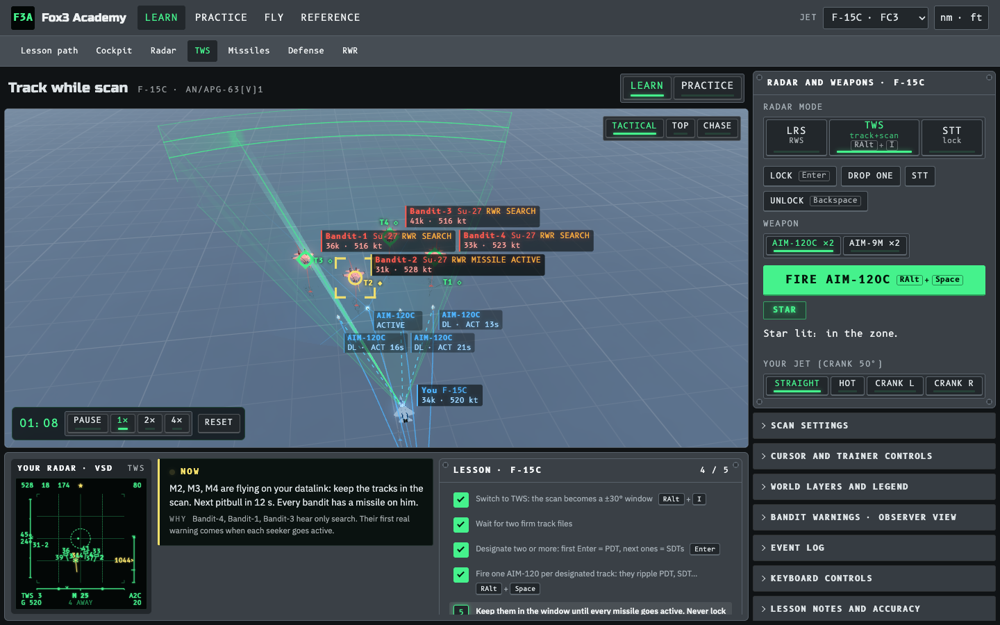
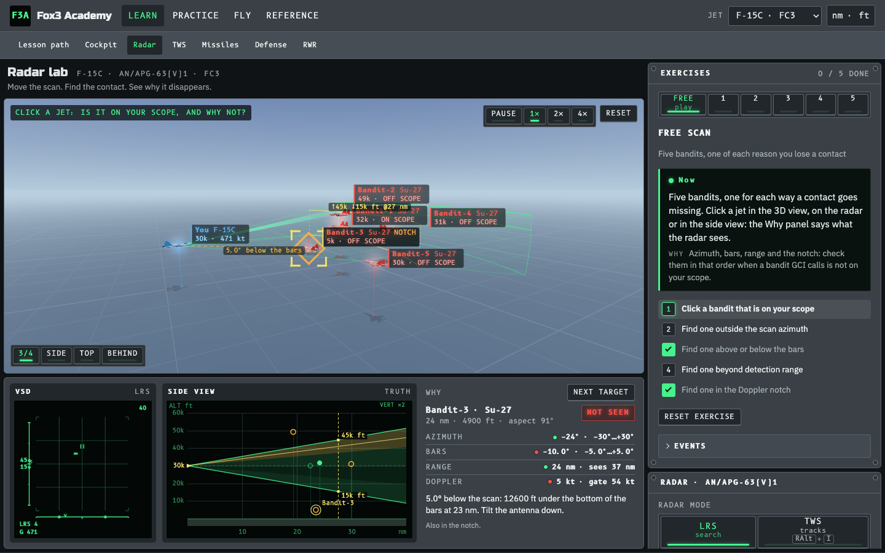
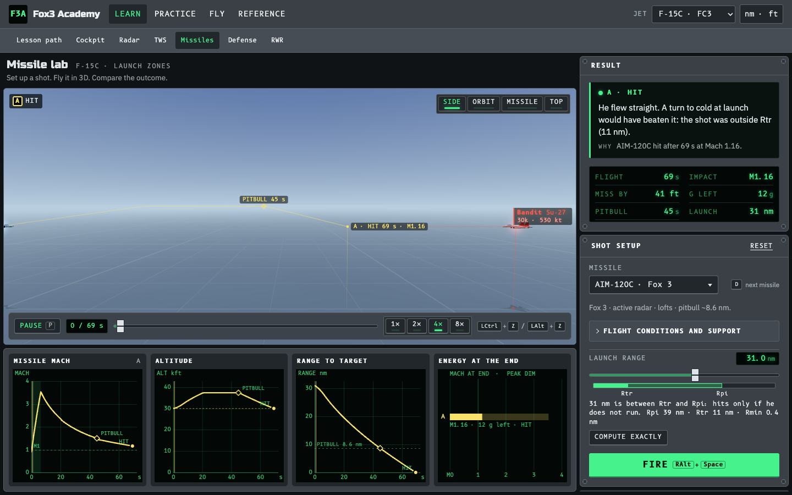
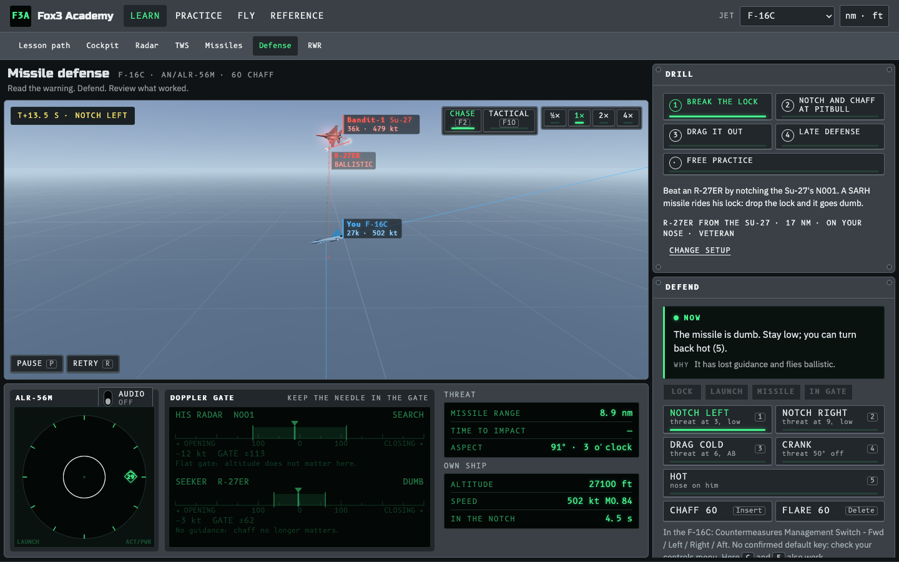
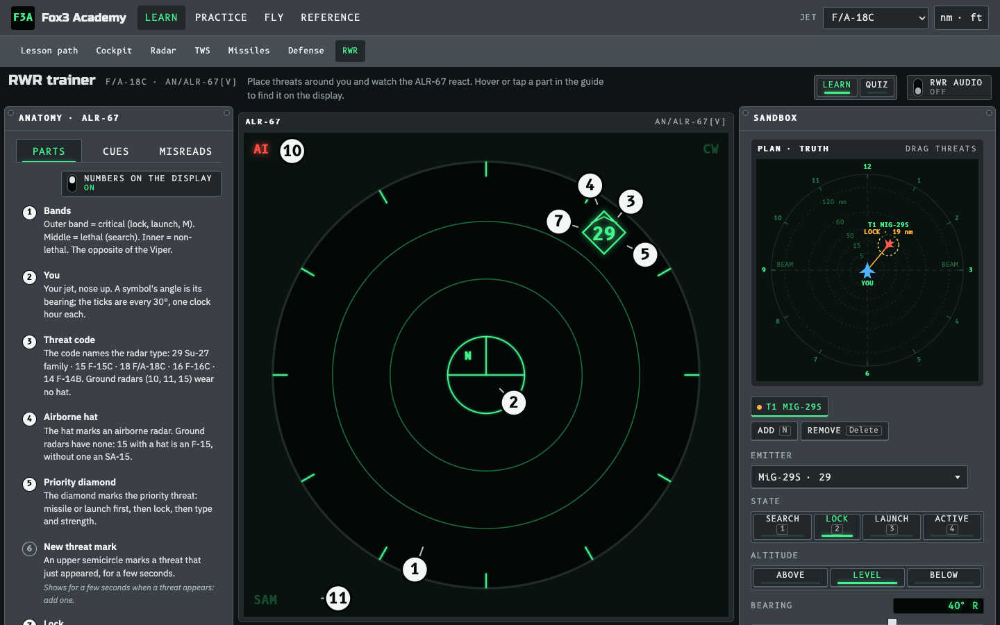
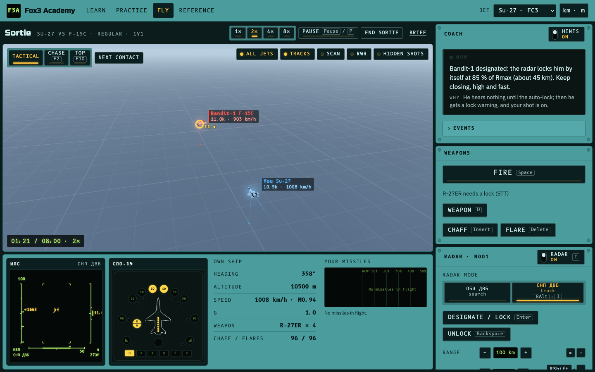
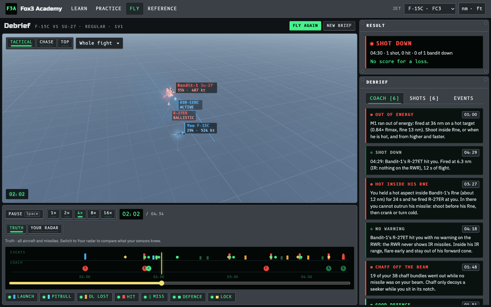

<div align="center">

# Fox3 Academy

**Learn BVR the way DCS World flies it.**
Radar, TWS, launch zones, missile defense and the RWR, in 3D, in your browser, for the jet you fly.

[](https://github.com/HDElectronics/Fox3-Academy/actions/workflows/ci.yml)
[](LICENSE)
[](https://github.com/HDElectronics/Fox3-Academy/wiki)
[](CONTRIBUTING.md)



</div>

## Why

You lost the lock and don't know why. Your AMRAAM went stupid at 30 nm. A Flanker fired at you and the RWR
said nothing. Fox3 Academy lets you see what the radar sees, fly the shot again, and watch the missile's
energy bleed off, without loading a mission or spending an evening getting shot down on a server.

- **See the scan volume.** Azimuth, bars, antenna elevation and the notch drawn in 3D around your jet.
- **Shoot and see the result.** Launch zones against altitude, speed, aspect and target manoeuvre, with plots.
- **Be the target.** Break the lock, notch and chaff at pitbull, drag the shot out.
- **Fly the whole fight.** 1v1 to 2v2 against AI that shoots back, then a Tacview-style debrief with coaching.

Ten jets, each with its own radar rules, RWR and key bindings: **Su-27, Su-33, J-11A, MiG-29S, F-15C,
F/A-18C, F-16C, F-14B, JF-17, M-2000C.** Russian jets get a metric, Russian-labelled cockpit skin.

## Screenshots

| Radar lab: why that contact is off your scope | Missile lab: launch zones and energy |
|---|---|
|  |  |
| **Defense: notch an R-27ER in an F-16C** | **RWR trainer: ALR-67 anatomy and threat sandbox** |
|  |  |
| **Sortie: Su-27 vs F-15C, СНП auto-lock** | **Debrief: replay, timeline and coaching** |
|  |  |

More pages and a tour of each module: [Wiki](https://github.com/HDElectronics/Fox3-Academy/wiki).

## Fly it

```
git clone https://github.com/HDElectronics/Fox3-Academy.git
cd Fox3-Academy
npm install
npm run dev          # http://localhost:5173
```

`npm run build` produces one self-contained `dist/index.html` you can open offline or drop on any static host.
`npm run build:web` produces a code-split `dist-web/` folder with a faster first load for normal static hosts.

## What it is, and what it is not

A tactics trainer for DCS gameplay. Radar, RWR and missiles are tuned to reproduce what DCS players see
(launch-zone numbers, RWR cues, what defeats a shot). It is not a flight model or a weapons simulation, and
every page says what it simplifies. Facts are sourced in [`docs/research`](docs/research); anything
unverified is labelled as such. Details: [DCS accuracy notes](docs/dcs-accuracy.md).

## Get involved

Fox3 Academy is built by DCS pilots for DCS pilots. You don't need to be a TypeScript expert to help.

- **Fly it and report.** Something behaves differently from DCS? [Open an issue](https://github.com/HDElectronics/Fox3-Academy/issues/new/choose) with the jet, the page and what DCS does.
- **Bring evidence.** Manual pages, track files, Tacview captures of a specific DCS version. Accuracy is the product.
- **Pick a task.** [BACKLOG.md](BACKLOG.md) is prioritised; the [project board](https://github.com/HDElectronics/Fox3-Academy/projects) tracks what is in flight. Issues tagged `good first issue` are a good start.
- **Add your jet.** Adding an aircraft is a well-trodden path: see [AGENTS.md](AGENTS.md#common-tasks).

Start with [CONTRIBUTING.md](CONTRIBUTING.md), then the [developer guide](docs/developer-guide.md).
Where it is heading: [ROADMAP.md](ROADMAP.md).

## Built with

TypeScript, three.js and Vite. No UI framework. `npm run check` runs typecheck, tests and the build.
Architecture: [ARCHITECTURE.md](ARCHITECTURE.md). All docs: [docs/README.md](docs/README.md).

## License

[MIT](LICENSE). Third-party assets and dependencies keep their own licenses. Fox3 Academy is an independent
fan project, not affiliated with or endorsed by Eagle Dynamics. DCS World is a trademark of its owner.
